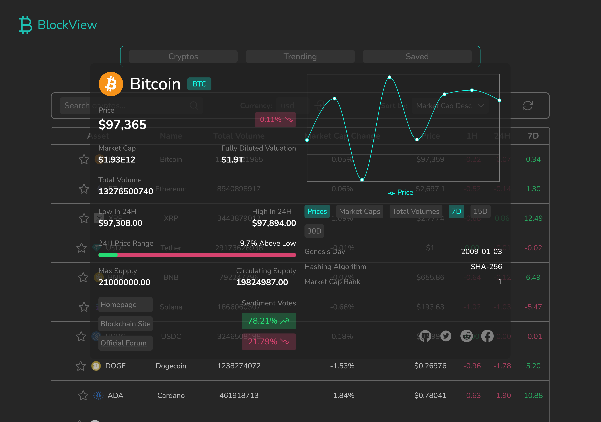

# BlockView - Cryptocurrency Tracking Platform

BlockView is a modern, responsive, and accessible cryptocurrency tracking platform built with React. It provides real-time cryptocurrency data, market trends, and detailed analysis tools for crypto enthusiasts and investors.

## Screenshot



## Features

- **Real-time Cryptocurrency Data**: Track live prices, market caps, and volume data
- **Customizable Watchlist**: Save and monitor your favorite cryptocurrencies
- **Trending Cryptocurrencies**: View currently trending crypto assets
- **Detailed Analytics**: Access comprehensive price charts and market statistics
- **Responsive Design**: Fully responsive layout that works on all devices
- **Accessibility Features**:
  - ARIA labels for screen readers
  - Semantic HTML structure
  - Keyboard navigation support
  - Color contrast compliance
- **Search Functionality**: Search and filter cryptocurrencies with debounced API calls
- **Currency Conversion**: Support for multiple fiat currencies
- **Pagination**: Efficient data loading with paginated results
- **Error Handling**: Comprehensive error states and loading indicators

## Live Demo

[Play around](/)

## Technologies Used

- React 18
- React Router v6
- Tailwind CSS
- Recharts
- CoinGecko API
- Lodash

## Getting Started

1. Clone the repository:

```bash
git clone https://github.com/KeepSerene/crypto-screener-react-site.git
```

2. Install dependencies:

```bash
cd crypto-screener-react-site
npm install
```

3. Start the development server:

```bash
npm run dev
```

4. Build for production:

```bash
npm run build
```

## Project Structure

```
blockview/
├── src/
│   ├── components/
│   ├── contexts/
│   ├── pages/
│   ├── utils/
│   └── App.jsx
├── public/
└── ...
```

## API Notice

This project uses the CoinGecko API's free tier, which has rate limitations. For production use, consider upgrading to their pro tier for better rate limits and additional features.

## Author

_Dhrubajyoti Bhattacharjee_

- GitHub: [@KeepSerene](https://github.com/KeepSerene)
- LinkedIn: [Dhrubajyoti Bhattacharjee](https://www.linkedin.com/in/dhrubajyoti-bhattacharjee-320822318/)

## Acknowledgments

- Data provided by [CoinGecko API](https://www.coingecko.com/en/api)

## License

This project is licensed under the MIT License - see the [LICENSE](LICENSE) file for details.
